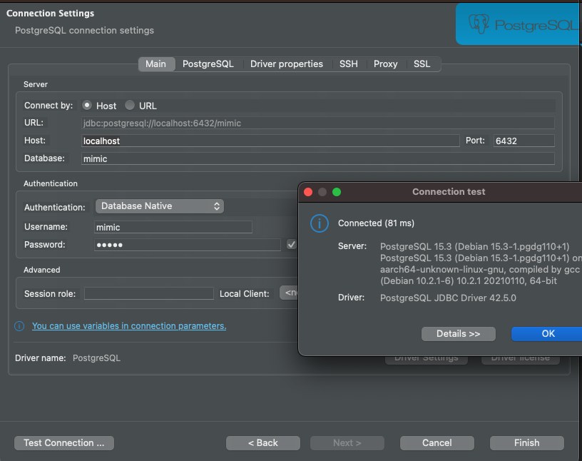

# Mimic data models

Step by step guide on how to design a data pipeline to ingest the data.

Table of contents:
- [Mimic data models](#mimic-data-models)
- [Set-up](#set-up)
  - [postgres database (Docker)](#postgres-database-docker)
  - [Connect to database](#connect-to-database)
  - [Set up spark locally](#set-up-spark-locally)


# Set-up

## postgres database (Docker)

```bash
# spins up a docker container of postgres on port 5432
docker container run --name mimic_db \                                               
                    -d -p 6432:5432 \
                    -e POSTGRES_USER=mimic \
                    -e POSTGRES_PASSWORD=mimic \
                    -e POSTGRES_DB=mimic \
                    postgres:latest
```

Then if you run `docker ps -a`, you can checkout all the available container
```bash
CONTAINER ID   IMAGE             COMMAND                  CREATED         STATUS                       PORTS                    NAMES
1cd96693dcd5   postgres:latest   "docker-entrypoint.s…"   3 seconds ago   Up 2 seconds                 0.0.0.0:6432->5432/tcp   mimic_db
7fbf1606b7ac   postgres:latest   "docker-entrypoint.s…"   27 hours ago    Exited (255) 9 minutes ago   0.0.0.0:5432->5432/tcp   songs
```

Our mimic container is right there with id 1cd96693dcd5 and on port 6432.


## Connect to database 

After we have our database, let's connect it using [dbeaver](https://dbeaver.io/) IDE.



Now you have your empty mimic database.


## Set up spark locally

```bash
# create an virtual environment with built-in "venv" in your local project dir
python -m venv .venv

# activate the virtual env via fish terminal
source .venv/bin/activate.fish

# 
pip install pyspark psycopg2
```